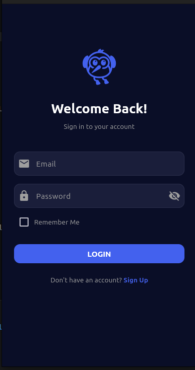
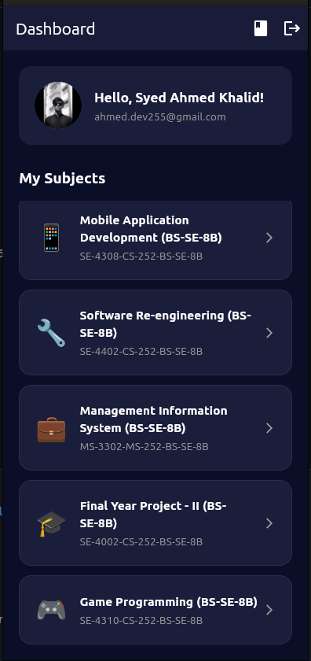
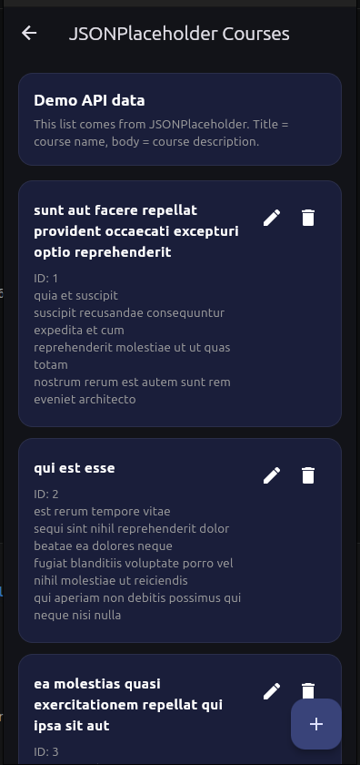
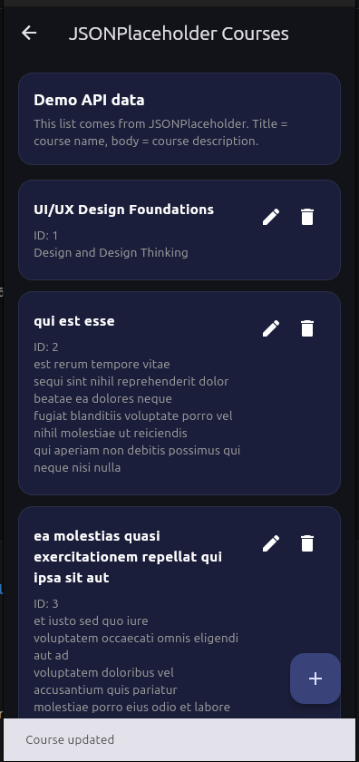

# flutter-auth-app
Flutter multi-screen app with auth and navigation

# Flutter Multi-Screen App

A complete multi-screen Flutter application built as part of the 
Mobile App Development course (CS-461).

## Extension: CRUD API Integration

This extension adds a REST API powered course management screen using **JSONPlaceholder**.

### API Used
- JSONPlaceholder fake REST API: https://jsonplaceholder.typicode.com/

### Documentation Followed
- Official guide: https://jsonplaceholder.typicode.com/guide

### CRUD Features
- **Read:** Fetch and display a list of courses from the API
- **Create:** Add a new course using `POST`
- **Update:** Edit a course using `PUT`
- **Delete:** Remove a course using `DELETE`

### API Architecture
- API calls are kept inside a dedicated service layer in `lib/services/course_service.dart`
- Shared state and CRUD actions are managed in `lib/controllers/course_controller.dart`
- UI screens consume the controller and only handle display and navigation

## Features

### Registration Screen
- Full name, email, gender selection
- Password with security requirements:
  - Minimum 6 characters
  - At least 1 uppercase letter
  - At least 1 special character
- Confirm password matching
- All fields required with real-time validation

### Login Screen
- Email format validation
- Password show/hide toggle
- Remember Me checkbox
- Navigation to Dashboard on success

### Dashboard Screen
- User name display with avatar
- Current subjects list:
  - Mobile App Development (CS-461)
  - Software Re-engineering (CS-445)
  - Management Information Systems (MIS-301)
- Tap to navigate to subject detail
- Logout button

### Courses Screen
- Fetches courses from JSONPlaceholder
- Shows loading and error states
- Add, edit, and delete actions
- Pre-filled edit form for updates
- Confirmation dialog before delete

### Detail Screen
- Subject header and banner
- Course description
- Class schedule information

## Architecture
- Custom Validator Class
- Controller Layer (business logic separated from UI)
- Shared course controller for API state handling
- Enum Implementation (Gender, FormStatus)
- Model Layer (UserModel)
- Service Layer for REST API calls

## Project Structure
lib/
├── main.dart
├── enums/
│   └── app_enums.dart
├── models/
│   └── user_model.dart
├── validators/
│   └── app_validators.dart
├── controllers/
│   └── auth_controller.dart
│   └── course_controller.dart
├── services/
│   └── course_service.dart
└── screens/
├── login_screen.dart
├── register_screen.dart
├── dashboard_screen.dart
├── detail_screen.dart
├── courses_screen.dart
└── course_form_screen.dart

## How to Run
```bash
flutter pub get
flutter run
```

## Student Info
- **Name:** Syed Ahmed Khalid
- **Course:** Mobile Application Development (CS-461)
- **Submitted to:** Roshana Mughal

## Repository Info
- **Current working branch:** feature/course-api-integration





